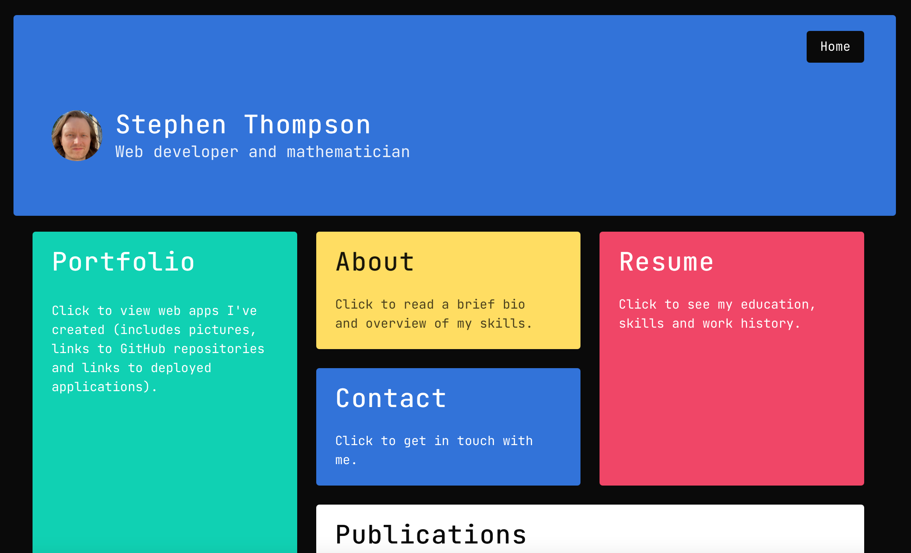
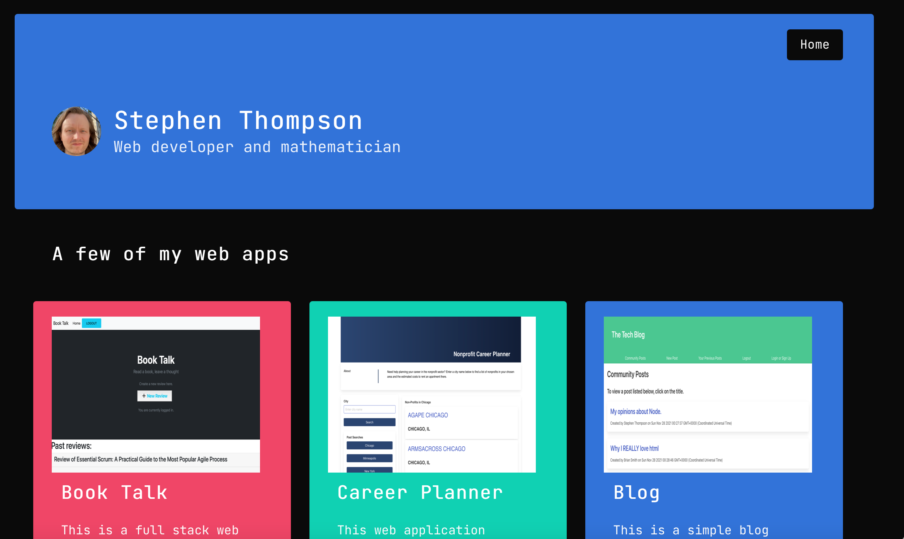

# React Portfolio

  ## Description

  This is my professional portfolio, which includes links to apps I've created, my resume and contact information. This is a Single Page Application, which I build using ReactJS. A link to the deployed application can be found here: https://sthompsonchicago.github.io/react-portfolio/. A link to the GitHub repo can be found here: https://github.com/SThompsonChicago/react-portfolio. 

  ## Table of Contents

  * [Installation](#installation)

  * [Images](#images)

  * [Contributing](#contributing)

  * [Tests](#tests)

  * [Questions](#questions)

  * [License](#license)

  ## Installation

  To install necessary dependencies, run the following command:

  npm i

  ## Images

  Here is a picture of the front page:

  

  Here is a picture of the portfolio page: 
  
  

  ## Contributing

  NA

  ## Tests

  To run tests, use the following command:

  npm test

  ## Questions

  My GitHub profile can be found at https://github.com/SThompsonChicago.
  You can contact me via email at s31@umbc.edu.

  
